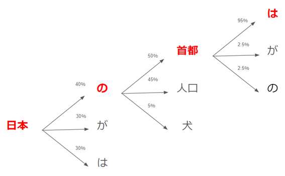
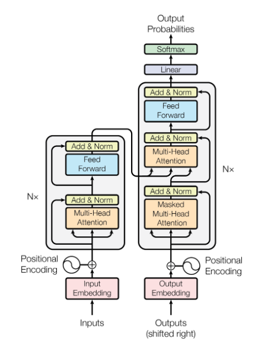
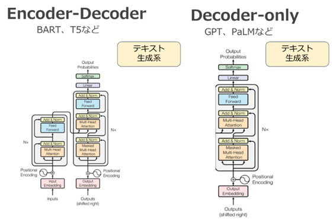
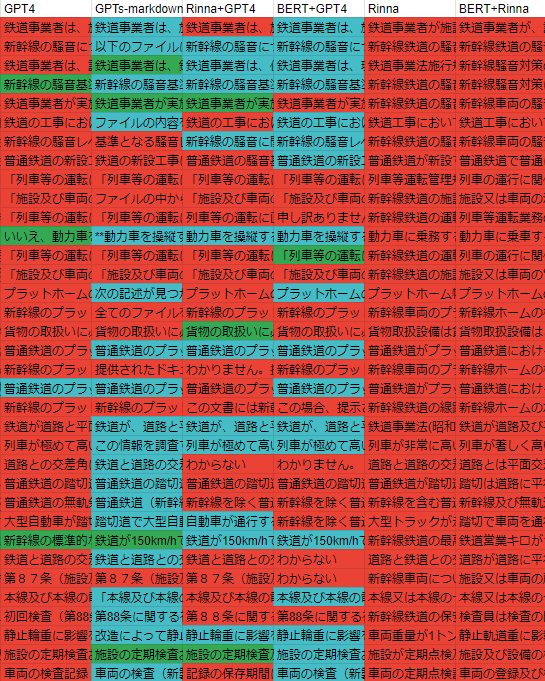

Railway Knowledge System with rinna
===

Ren Nakagawa


made by DALL-E 3

# Introduction

2015年に女子高生AIとしてLINEに登場し話題になったりんなは、今回鉄道ナレッジシステムに転職しました🚂✨。

AI女子高生りんなは、Microsoftが開発したAIチャットボットで、日本の女子高校生を模したキャラクターです👧🎓。りんなは、LINEを通じてユーザーと会話し、日常の雑談や質問に答えることで、まるで本物の女子高生と話しているような体験を提供します💬😊。

今回、りんなを使って鉄道ナレッジシステムを構築しました🛠️🚉。このシステムは、りんなの自然な対話能力を活かし、鉄道に関する質問や情報提供を人間に尋ねるように行うことができます🗣️💡。

# Lecture


### 文章生成モデルとは
> 文章生成モデルは、単語列に対して次にくる単語を予測する構造をしています。例えば`「日本」「の」「首都」「は」`という単語列を文章生成モデルに入力をすると、次にくる単語は`「東京」`と予測し、`「日本」「の」「首都」「は」「東京」`という単語列を入力をすると、次にくる単語は`「です」`と予測します。

> これは数式で表すと、次にくる単語を`ｘ`として`Ｐ（ｘ；日本，の，首都，は）`という条件付き確率を計算し，様々な単語ｘについて計算される条件付き確率`Ｐ1（東京；日本，の，首都，は）＝0.7`、`Ｐ2（パリ；日本，の，首都，は）＝0.2`、`Ｐ3（きゅうり；日本，の，首都，は）＝0.01`・・・と出力されるなかで最大値をもつ条件付き確率`Ｐ1（東京；日本，の，首都，は）`を取り出す操作によって実現しています。

> すなわち文章生成モデルは条件付き`確率Ｐ（次にくる単語；今までの単語）`を語彙単語分計算する関数であると解釈することができます。
その条件付き確率の列から最大値を持つ単語を取り出すことで次の単語を予測することができ、そのループを行うことで文章を生成することができます。



### ざっくりTransformer
> Transformerは、自然言語処理の革新的なモデルで、エンコーダーとデコーダーの2つの部分から成り立ちます。

> エンコーダーは入力文章を内部表現に変換し、デコーダーはその情報を基に新しい文章を生成します。

> Transformerの特徴はAttentionメカニズムを使用することで、文章全体の文脈を捉えつつ重要な部分に重点を置いて処理できる点にあります。また、Multi-Head Attentionにより各単語が文中の他の全単語に複数の視点から注意を払うことが可能です。さらに、位置エンコーディングによって単語の順序情報も加味され、並列処理が可能で高速かつ長距離依存の関係性も効果的に学習できます。




Attention Is All You Need

### BARTとGPT
> 文章生成モデルには大きくBART（Bidirectional and Auto-Regressive Transformers）型とGPT（Generative Pre-trained Transformer）型があります。
  
> BART型は、エンコーダーとデコーダーの両方を備えた構造をしており、入力文章の補完や要約などに強みがあります。BERT型の日本語LLMにはcl-tohoku/bert-base-japaneseがあり、日本語Wikipedeiaで学習したモデルです。

>GPT型はデコーダーのみを使用し、与えられたプロンプトに基づいて続きの文章を生成することに特化しています。GPT型の日本語LLMにはrinna/japanese-gpt2-mediumがあり、Japanese-CC-100と日本語Wikipediaで学習したモデルです。


LLM 大規模言語モデル講座 講義資料 © 2023 by 東京大学松尾研究室 is licensed under CC BY-NC-ND 4.0

## 文章生成モデルの応用方法

### LLMの課題


LLMは、主に以下3つの課題があります。

- 情報が古い可能性がある
- 言語ごとの精度のばらつき
- 情報の正確性

1つ目はLLMは、最新情報には対応できないことです。学習済みのデータから人間が会話しているような回答を生成する技術のため、ニュースのような日々移り変わる内容には対応していません。

2つ目は言語により回答精度のばらつきがあることです。英語は情報が多く比較的に精度が高いと言われていますが、日本語など他の言語では精度が下がるとされている点に注意が必要です。これはインターネット上にある言語の情報量によって左右されているため、言語ごとのばらつきが生じています。

3つ目は出力された内容の正確性でLLMが存在しない情報を出力することはハルシネーションと呼ばれています。これは、文章生成モデルはあくまで自然な次の単語を推論するだけの為、正確性は度外視した推論である為に起こります。

そのためLLMを目的に特化するように応用する必要があります。

### 文章生成モデルの応用
> 目的に特化させたLLMを構築する方法は大きく以下の4段階に分けることができます。  

- プロンプトエンジニアリング
- 外部ツールの利用
- ファインチューニング
- 事前学習

> 今回は「プロンプトエンジニアリング」と「外部ツールの利用」の2つを利用します。具体的には「鉄道に関する技術上の基準を定める省令の解釈基準」という資料をLLMを用いてベクトル列に変換しベクトルデータベースとして保存します。  
その後、ベクトルデータベースとプロンプトとの関連度を検索し、データベースから関連部分のみを抽出してプロンプトにコンテキストとして加えるようなナレッジ検索システムを構築します。


# Demo

## Set up environment


```python
!git clone https://github.com/rakawanegan/pbl-railway-knowledge-system
%cd pbl-railway-knowledge-system
%pip install transformers faiss-gpu fugashi ipadic >> install.txt
```

    Cloning into 'pbl-railway-knowledge-system'...
    remote: Enumerating objects: 147, done.
    remote: Counting objects: 100% (147/147), done.
    remote: Compressing objects: 100% (88/88), done.
    remote: Total 147 (delta 67), reused 116 (delta 38), pack-reused 0
    Receiving objects: 100% (147/147), 937.60 KiB | 3.41 MiB/s, done.
    Resolving deltas: 100% (67/67), done.
    /content/pbl-railway-knowledge-system


## Import modules


```python
from glob import glob
import markdown
from bs4 import BeautifulSoup
import torch
import faiss # Facebook AI Similarity Search
from transformers import AutoTokenizer, AutoModel, GPT2Tokenizer, GPT2LMHeadModel
```

## Set up dataset


```python
!rm data.md
for file in sorted(glob('data/*.md')):
    print(file)
    !cat {file} >> data.md
    !echo "" >> data.md
```

    rm: cannot remove 'data.md': No such file or directory
    data/01.md
    data/02.md
    data/04.md
    data/05.md
    data/09.md


## Load dataset


```python
def load_markdown_file(file_path):
    with open(file_path, 'r', encoding='utf-8') as f:
        text = f.read()
    return text

markdown_text = load_markdown_file('data.md')
print(markdown_text)
```

    # 1. 総則
    ## 1.1 第3条(実施基準)関係
    
    ### 1.1.1 
    鉄道事業者は、施設、車両の設計及び維持管理並びに運行を行うにあたって、省令の範囲内で個々の鉄道事業者の実状を反映した詳細な実施基準を策定することとする。
    実施基準の項目は、省令等の項目に対応したものとし、内容は、解釈基準により示された例示、設計方法、検証方法等に準じて、数値化する等具体的に示すこととする。
    
    ### 1.1.2 
    実施基準は、本解釈基準を参考に定めるものとするが、技術的実績に応じ、実証データによる確認や理論解析等客観的な検討方法により、鉄道事業者が省令への適合を証明した場合には、本解釈基準によらない構造等を妨げないものであり、届出をする際にその根拠等について説明をすることとする。
    ただし、廃止前の普通鉄道構造規則、新幹線鉄道構造規則、特殊鉄道構造規則、新幹線鉄道運転規則及び鉄道運転規則(以下「旧省令」という。)において、特別の構造又は取扱いの許可(以下「特別許可」という。)を受け、又は附則に基づく経過措置により、特別許可を受けたものとみなされた施設、車両及び取扱いであって、この解釈基準に適合しないものについては、この限りでない。
    
    ### 1.1.3 
    2ただし書の施設、車両及び取扱いのうち、旧省令の施行後最初に行う改築又は改造の工事が完成するまでの間、特別許可を受けたものとみなされたものについては、省令の施行後において改築又は改造することを前提にするものとそれ以外のものとに整理し、経過措置あるいは条件を付した基準とするなどの方法により、実施基準に規定するものとすること。
    
    ### 1.1.4
    2ただし書の施設、車両及び取扱い(3の施設、車両及び取扱いを除く。)については、旧省令と異なる構造とすることとしたときの条件を考慮して、条件を付した基準とするなどの方法により、実施基準に規定するものとすること。
    
    ## 1.2 第5条(危害の防止)関係
    のり切り、切土、掘削、盛土、くい打ち等の土砂の掘削等を伴う鉄道の工事にあたっては、工事中及び存続期間中に土砂崩壊、陥没、排土すべり出し等によって人に危害を及ぼさないように工事を行うこと。
    
    ## 1.3 第6条(著しい騒音の防止)関係
    ### 1.3.1
    新幹線の騒音については、新幹線鉄道に係る環境基準(環境省(旧環境庁)告示)によるものとするが、音源対策が騒音の防止または軽減を図る上で最も基本的な施策であり、早期にその達成が困難なことから、環境省(旧環境庁)からの要請により、東海道、山陽、東北、上越の各新幹線については、当面、沿線の住宅の集合度合いに応じ、音源対策により順次75デシベル以下とすることを目標とする。
    その測定にあっては、沿線屋外の地上 1.2 メートルの高さにおいて、騒音のピークレベルのパワー平均値により行い、その位置は、地域の騒音を代表する地点として近接側軌道中心線から 25 メートルの位置を原則とする。
    ただし、住宅の建築が禁じられている工業専用地域、現にほとんど人が住んでいない山林、原野、農耕地は上記を適用しない。
    
    ### 1.3.2 
    普通鉄道(新幹線を除く。)の新設又は大規模改良に際しては、沿線屋外の地上 1.2 メートルの高さにおける近接側軌道中心線から水平距離が 12.5 メートルの地点において、次の騒音レベルとする。
    
    #### 1.3.2.1
    新設は、等価騒音レベルとして、昼間(7 ~ 22 時)は 60 デシベル以下、夜間(22~翌7時)は55デシベル以下とする。
    
    #### 1.3.2.2
    大規模改良は、騒音レベルの状況を改良前より改善する。
    この場合において、新設とは、鉄道事業法第8条の工事の施行認可を受けて工事を施行する区間、また、大規模改良とは、複線化、複々線化、道路との連続立体交差化又はこれに準ずる立体交差化を行うため、鉄道事業法第12条の鉄道施設の変更認可を受けて工事を施行する区間をいう。
    
    ####1.3.2.3
    なお、次の区間及び場合については、1.3.2.1及び1.3.2.2を適用しないものとする。
    - 住宅を建てることが認められていない地域及び通常住民の生活が考えられない地域
    - 地下区間(半地下、掘り割りを除く。)
    - 踏切等防音壁(高欄を含む。)の設置が困難な区間及び分岐器設置区間、急曲線区間等ロングレール化が困難な区間
    - 事故、自然災害、大みそか等通常と異なる運行をする場合
    
    # 2. 係員
    ## 2.1 第１０条（係員の教育及び訓練等）関係
    ### 2.1.1
    「列車等の運転に直接関係する作業を行う係員」は、次のとおりとすること。
    - 列車等を操縦する係員
    - 列車の運転順序変更、行き違い変更、運転の取消し等の運転整理を行う係員
    - 列車防護、ブレーキの操作又は運転上必要な合図を行うために列車に乗務する係員
    - 列車等の進路制御、閉そく、鉄道信号の取扱い又は転てつ器の操作をする係員
    - 線路、電車線路又は運転保安設備の保守、工事等で列車の運転に直接関係があるものを単独で行い、又は指揮監督する作業を行う係員
    - 踏切保安設備を操作する係員
    ###2.1.2
    「施設及び車両の保守その他これに類する作業を行う係員」は、次のとおりとし、鉄道事業者が「施設及び車両の保守その他これに類する作業」を委託する場合にあっては、委託した作業を行う鉄道事業者に所属する係員以外の係員を含むものとすること。
    - 構造物、線路及び建築物の保全業務を行う係員
    - 電気設備及び運転保安設備の保全業務を行う係員
    - 車両の検査・修繕業務を行う係員
    - 電力設備の機器開閉操作を直接行う係員
    ###2.1.3
    １の係員に対する適性の確認は、身体機能検査及び精神機能検査により行うこと。
    ###2.1.4
    １の係員に対する教育及び訓練の実施、適性、知識及び技能の確認は、当該係員の所属する鉄道事業者（係員が所属している事業者が鉄道事業者以外の場合にあっては、当該作業を委託した鉄道事業者。以下同じ。）が実施要領を定めて行うこととする。ただし、教育及び訓練の実施、適性、知識及び技能の確認の管理を当該鉄道事業者が行う場合は、他の者にこれを行わせることができる。
    ###2.1.5
    １(1)及び(3)の係員に対しては、乗務前、列車の運転中その他適当なときに運転上必要な事項について報告を求め、又は指示を与える等適切な監督ができる体制を整えておくこと。
    ###2.1.6
    第３項の知識及び技能を十分に発揮できない状態のうち、１(1)の係員（本線を支障するおそれのない側線において移動する車両を操縦する係員を除く。６において同じ。）に対する酒気を帯びた状態の確認は、次のとおりとすること。
    ####2.1.6.1
    仕業前後に対面（運行上やむを得ない場合は電話その他の方法。）により、酒気帯びの有無を確認すること。
    ####2.1.6.2
    酒気帯びの有無の確認は、目視等によるほか、アルコール検知器を用いて行うこと。ただし、仕業前の確認以降、１(1)の係員が鉄道事業者の管理の下にある場合は、仕業後のアルコール検知器を用いた検査を省略することができる。
    ####2.1.6.3
    仕業前に酒気を帯びた状態が確認された場合には、当該係員を乗務させないこと。
    ####2.1.6.4
    次に掲げる事項を記録し、かつ、その記録は、期間を定めて保存すること。
    - 確認を行った者及び確認を受けた者の氏名
    - 確認の日時
    - 確認の方法（対面、電話等）
    - 酒気帯びの有無（目視等での確認結果、アルコール検知器で測定した数値）
    ###2.1.7
    ２の係員に対する教育及び訓練は、鉄道事業者の管理のもとに他の者が行う教育及び訓練を含むものとする。
    ##2.2 第１１条（動力車を操縦する係員の乗務等）関係
    ###2.2.1
    第１項ただし書中「施設及び車両の構造等により、当該係員を乗務させなくても列車の安全な運転に支障がない場合」は、次の各号を満たす場合であり、かつ、第３６条第３号、第５８条、第８６条第２項に規定する基準に適合するものであること。
    ####2.2.1.1
    人等が容易に線路内に立ち入ることができない構造であり、かつ、列車の進路を支障する落石などの事態が発生するおそれのない鉄道である場合。ただし、線路上に列車運行上の障害となる事象が発生したことを検知し、自動的に列車を停止できる装置を備える場合その他列車の安全な運転に支障を及ぼすおそれのない措置を講じた場合は、この限りでない。
    ####2.2.1.2
    隣接線路に対する列車防護を必要としない構造又は形態の鉄道である場合。ただし、列車防護に当たる係員を乗務させる場合、又は隣接線路に支障を及ぼす事象を検知し自動的に列車を停止できる装置を備える場合は、この限りでない。
    ####2.2.1.3
    緊急時に旅客が容易に避難できる鉄道である場合。
    ###2.2.2
    第２項第２号は、本線の列車運行に支障を及ぼさない区域内、例えば、入出庫線又は側線での運転の誤りが直ちに本線を支障するおそれのある区間以外の側線の区域内で移動する場合をいう。
    ###2.2.3
    動力車を操縦する係員は、酒気を帯びた状態又は薬物の影響により正常な操縦ができないおそれがある状態で列車に乗務しないこと。
    #4. 停車場
    ##4.1 第３５条(駅の設備)関係
    ###4.1.1
    旅客又は貨物の取扱いに必要な相当な設備は、次のとおりであり、旅客の乗降客数、貨物の取扱い量等を考慮した設備を設ける必要がある。
    ####4.1.1.1
    旅客の取扱いに必要な駅設備とは、プラットホ－ム、流動設備（通路、コンコース、階段、こ線橋、エレベーター、エスカレーター等）、接客設備（出改札）、滞留設備（出札、待合室）、業務施設（駅務施設）、便所、照明設備等である。
    ####4.1.1.2
    貨物の取扱いに必要な駅設備とは、貨物積卸設備（ホーム、コンテナ着発線荷役設備）、貨物通路、荷捌き保管設備、関係諸建物（駅本屋、保管庫、従業員詰所）、通運関係設備等をいう。
    ###4.1.2
    駅を利用する旅客に有用な情報提供するための設備とは、旅客を出改札口、コンコース、プラットホーム、トイレ等へ適切に誘導案内するための設備であり、誘導サイン、位置サイン、案内サイン、規制サイン等の設備をいう。
    ##4.2 第３６条（プラットホーム）関係
    プラットホームは、旅客の利用の安全に支障を及ぼすおそれのないものであって、次の基準に適合するものであること。
    ###4.2.1
    無軌条電車以外の鉄道のプラットホームの有効長は、当該プラットホームに発着する列車の最も前方にある旅客車から最も後方にある旅客車（車両に直接接続する形式のホームドアを設ける場合においては、列車の最も前方にある乗降口の前端から最も後方にある乗降口の後端）までの長さのうち最長のものの長さ以上であって、かつ、旅客の安全及び円滑な乗降に支障を及ぼすおそれのないものであること。ただし、当該プラットホームにおける乗降人員が少ない場合であって、列車の運用上やむを得ない場合にあっては、ドア非扱いを行い、かつ、案内放送を行う等の旅客の転落等の危険を防止するための措置を講ずることによりプラットホームの有効長を発着する列車長に対して短くすることができる。
    ###4.2.2
    プラットホームの幅は、次のとおりとする。
    ####4.2.2.1
    普通鉄道（新幹線を除く。）及び特殊鉄道（新幹線を除く。）のプラットホームの幅は、両側を使用するものにあっては中央部を 3m 以上、端部を 2m 以上、片側を使用するものにあっては中央部を 2m 以上、端部を 1.5m 以上とする。
    ####4.2.2.2
    新幹線のプラットホームの幅は、両側を使用するものにあっては 9m 以上、片側を使用するものにあっては 5m 以上とする。ただし、曲線に沿うプラットホームの端部については、両側を使用するものにあっては 5m 以上、片側を使用するものにあっては 4m以上とすることができる。
    ###4.2.3
    普通鉄道（新幹線を除く。）及び特殊鉄道(無軌条電車及び新幹線を除く。)のプラットホームにある柱類及びこ線橋口等の壁とプラットホームの縁端との距離は、次のとおりとする。
    ####4.2.3.1
    プラットホームにある柱類とプラットホームの縁端との距離は 1.0m 以上とする。
    ####4.2.3.2
    プラットホームにあるこ線橋口、地下道口、待合所等とプラットホームの縁端との距離は、1.5m 以上とする。
    ####4.2.3.3
    ①及び②の規定は、列車に対し十分に旅客を防護する設備(以下「ホームドア又は可動式ホーム柵」という。)を設けたプラットホームについては、適用しない。
    ####4.2.3.4
    ホームドア又は可動式ホーム柵を設けたプラットホームにあっては、プラットホームにあるこ線橋口、地下道口、待合所等とホームドア又は可動式ホーム柵との距離は、1.2m以上（旅客の乗降に支障を及ぼすおそれのない箇所にあっては、0.9m 以上）とする。
    ###4.2.4
    新幹線のプラットホームにある柱類及びこ線橋口等の壁とプラットホームの縁端との距離は、次のとおりとする。
    ####4.2.4.1
    プラットホームにある柱類とプラットホームの縁端との距離は 2m 以上とする。
    ####4.2.4.2
    プラットホームにあるこ線橋口、地下道口、待合所等とプラットホームの縁端との距
    離は、2.5m(通過列車を運転する線路に沿うプラットホームにあっては、3m)以上とす
    る。
    ####4.2.4.3
    ①及び②の規定は、ホームドア又は可動式ホーム柵を設けたプラットホームについては、適用しない。
    ####4.2.4.4
    ホームドア又は可動式ホーム柵を設けたプラットホームにあっては、(3)④の規定によることとする。
    ###4.2.5
    列車の速度、運転本数、運行形態等に応じ、プラットホーム上の旅客の安全を確保するため、次のとおりとする。
    ####4.2.5.1
    第７条の規定のうち、一般の旅客に対しても、安全上の観点から必要なものとして、次によることを標準とする。
    - プラットホームと車両の旅客用乗降口の床面とは、できる限り平らであること。
    - プラットホームの縁端と旅客車の床面又は踏み段の縁端との間隔は、車両の走行に支障を及ぼすおそれのない範囲において、できる限り小さくすること。ただし、構造上の理由によりやむを得ず当該間隔が大きい場合は、旅客に対しこれを警告するための設備を設けること。
    - プラットホームの線路側以外の端部には、旅客の転落を防止するための柵を設けること。ただし、当該端部が階段である場合、その他の旅客が転落するおそれのない場合は、この限りでない。
    - プラットホームの床の表面は、旅客が滑りにくい仕上げにすること。
    - プラットホーム上の旅客に対し、列車の接近を文字等による警告するための設備及び音声により警告するための設備を設けること。ただし、電気設備がない場合その他の技術上の理由によりやむを得ない場合は、この限りでない。
    ####4.2.5.2
    プラットホーム縁端の笠石等は、滑り止めを付けるなど、滑りにくい仕上げとすること。
    ####4.2.5.3
    普通鉄道のプラットホームにおいて、130km/h を超える速度で通過する列車がある場合には、通過する列車の速度、車両形状に応じて、次のいずれかの措置を講ずること。
    - ホームドア又は可動式ホーム柵を設ける。
    - 列車が通過する際には、旅客がホーム上に出ないような措置を講ずる。
    - ホーム係員による旅客への注意喚起等により旅客の安全を確保する。
    ####4.2.5.4
    跨座式鉄道、懸垂式鉄道及び無軌条電車以外の鉄道において、列車の速度が高く、運転本数の多い区間におけるプラットホームについては、旅客の安全を図るため、次の措置を講ずること。ただし、ホームドア又は可動式ホーム柵が設置されている場合は除く。
    - 非常時に列車を停止させるための押しボタン又は転落検知マットを設置する。
    - 転落した旅客が待避できるよう、プラットホームの全長にわたり、プラットホーム下に待避スペースを確保する。ただし、構造上等やむを得ない場合は、プラットホームに上がるためのステップとすることができる。
    ####4.2.5.5
    動力車を操縦する係員が乗務しない鉄道のプラットホームには、ホームドア又は可動式ホーム柵を設けること。
    ####4.2.5.6
    磁気誘導式鉄道のプラットホームには、ホームドア又は可動式ホーム柵を設けること。
    ####4.2.5.7
    ①(ｲ）及び(ｵ）並びに②の規定は、車両に直接接続する形式のホームドアを設けたプラットホームについては、適用しない。
    ###4.2.6
    ホームドア又は可動式ホーム柵の開口部とプラットホームの縁端との間は、旅客の居残りを防止する措置を講ずること。
    ###4.2.7
    可動式ホーム柵は、旅客が通常の使用において、プラットホームからの転落や列車への接触を十分に防止できる構造であること。
    
    #5. 道路との交差
    ##5.1 第３９条（道路との交差）関係
    鉄道が、道路と平面交差できる場合とは、新幹線又は新幹線に準ずる速度（160km/h を超え 200km/h 未満）で運転する鉄道以外の鉄道で、鉄道の運転本数及び道路の交通量が少ない場合や鉄道路線の地勢地形等の状況から立体交差化が真に困難な状況の場合に限る。
    ##5.2 第４０条（踏切道）関係
    普通鉄道（新幹線を除く。）、無軌条電車及び鋼索鉄道の踏切道は、次の基準に適合するものであること。
    ###5.2.1
    踏切道の路面は舗装したものであること。
    ###5.2.2
    鉄道と道路との交差角は４５度以上であること。
    ###5.2.3
    警標を設けること。
    ###5.2.4
    第６２条関係の解釈基準に規定する踏切保安設備を設けること。
    ###5.2.5
    列車が極めて高い速度（130km/h を超え 160km/h 以下）で通過する踏切道は、踏切遮断機、障害物検知装置（自動車が通行する踏切道に限る。）が設けられていること。また、この場合において、自動車が通行する踏切道は大型自動車が通行しないものであること。ただし、やむを得ず大型自動車が通行する踏切道には、二段型遮断装置、大型遮断装置、オーバーハング型警報装置等、踏切の視認性を高める等の大型自動車の踏切支障を有効に防止するための措置を行うこと。
    #9.施設及び車両の保全
    ##9.1  第８７条（施設及び車両の保全）関係
    構造物及び軌道の保全については、「鉄道構造物等維持管理標準の制定について」（平成19年1月16日付け国鉄技第73号）の通達によること。
    ###9.1.2 第８８条（新設した施設、新製した車両等の検査及び試運転）関係
    - トンネルに関する初回検査は、十分な照明を用いて入念な目視及び打音を行い、又はこれらと同等以上の方法により実施すること。
    - 静止輪重に影響を及ぼすおそれがある改造等を行った場合は、輪重を直接測定し、適切な静止輪重比であることを確認すること。
    ##9.2 第８９条（本線及び本線上に設ける電車線路の巡視及び監視並びに列車の検査）関係
    ###9.2.1
    本線及び本線の電車線路は車両の所定の速度で安全に運転することができる状態に保持するため、線区の状況、列車の運行状況に応じて巡視すること。巡視の頻度や時期、方法などについては、状況に応じて定めること。
    ###9.2.2
    本線において列車の運転に支障を及ぼす災害のおそれのある場合には、当該線路の監視を行い、必要に応じて運転速度を制限したり、又は、その線区あるいは区間の運転を休止すること。また、想定される災害に応じた当該線路の監視体制、列車の制限速度等をあらかじめ定めておくこと。
    ###9.2.3
    列車の検査は、事業者が車両の使用状況、設計方法、管理方法又は運行状況等を考慮して、検査時期及び検査内容を定めて行うこと。
    ##9.3 第９０条（施設及び車両の定期検査）関係
    ###9.3.1 
    鋼索鉄道の検査は、別紙第４の「鋼索鉄道の検査について」によること。
    ###9.3.2
    鋼索鉄道の索条の交換は、別紙第５の「鋼索鉄道の索条交換基準について」によること。
    ##9.4 第９１条（記録）関係
    ###9.4.1
    施設の定期検査及び改造、改築、修理の記録は、期間を定めて保存すること。また、橋りょう、トンネルその他の構造物の変状記録は、当該構造物の変状履歴が把握できるよう保存すること。なお、トンネルの初回全般検査、通常全般検査及び特別全般検査等の結果は、変状展開図等に記録し、検査の都度これを修正すること。
    ###9.4.2
    車両の検査（新製した車両等の検査及び定期検査の記録は、当該検査後最初に行われる全般検査を終えるまで保存すること。また、車両の定期検査をその年月及び場所を当該車両に表記すること。ただし、機能・状態検査を除く。定期検査の年月日及び場所を全般にわたって管理している場合は、車両の表記を省略できる。
    


## RAG(retrieval augmented generation)


```python
tokenizer = AutoTokenizer.from_pretrained("cl-tohoku/bert-base-japanese")
model = AutoModel.from_pretrained("cl-tohoku/bert-base-japanese")

def embed_text(texts):
    inputs = tokenizer(texts, padding=True, truncation=True, return_tensors="pt")
    with torch.no_grad():
        embeddings = model(**inputs).last_hidden_state.mean(dim=1)
    return embeddings.numpy()
```

    /usr/local/lib/python3.10/dist-packages/huggingface_hub/utils/_token.py:89: UserWarning: 
    The secret `HF_TOKEN` does not exist in your Colab secrets.
    To authenticate with the Hugging Face Hub, create a token in your settings tab (https://huggingface.co/settings/tokens), set it as secret in your Google Colab and restart your session.
    You will be able to reuse this secret in all of your notebooks.
    Please note that authentication is recommended but still optional to access public models or datasets.
      warnings.warn(


    tokenizer_config.json:   0%|          | 0.00/120 [00:00<?, ?B/s]


    /usr/local/lib/python3.10/dist-packages/huggingface_hub/file_download.py:1132: FutureWarning: `resume_download` is deprecated and will be removed in version 1.0.0. Downloads always resume when possible. If you want to force a new download, use `force_download=True`.
      warnings.warn(


    config.json:   0%|          | 0.00/479 [00:00<?, ?B/s]


    vocab.txt:   0%|          | 0.00/258k [00:00<?, ?B/s]


    pytorch_model.bin:   0%|          | 0.00/445M [00:00<?, ?B/s]


```python
emb = embed_text(['安全・安心な鉄道輸送の維持に向け、国土交通省はさまざまな情報を公開している。'])
print(emb.shape)
print()
print(emb)
```

    (1, 768)
    
    [[ 2.35450894e-01 -8.96722600e-02 -9.49342176e-02  8.57493505e-02
      -4.72914986e-02  1.09325516e+00  9.39331353e-02  1.35543287e-01
      -4.45025623e-01 -5.41056395e-01 -3.36215720e-02 -6.84493706e-02
       1.89359002e-02  3.86482477e-01 -1.30605558e-02  2.03806192e-01
      -1.39382586e-01 -5.20241559e-01 -1.49258092e-01 -1.14671970e-02
      -4.21623848e-02 -5.49967773e-02  5.76097071e-02  7.01275617e-02
      -1.23606242e-01 -8.79746228e-02 -2.49906749e-01  1.34349555e-01
       3.14442873e-01 -6.85880110e-02  1.90720364e-01  1.42175823e-01
      -1.30729387e-02  4.18568492e-01  2.45974258e-01  3.77085656e-01
       1.73258826e-01  3.03281873e-01  1.25731960e-01  1.58805594e-01
      -2.94065736e-02 -9.29155946e-02  4.48404670e-01  6.63364902e-02
      -5.00097573e-01  5.00147929e-03 -1.65162403e-02 -2.91508287e-01
       1.69307798e-01 -5.56728303e-01 -1.90632820e-01  1.09798089e-01
       1.49958972e-02  3.45879972e-01 -1.39213175e-01 -2.58095473e-01
       9.76742983e-01  3.42820346e-01 -2.52488256e-01 -9.03847143e-02
      -2.63260812e-01  8.16575736e-02  1.62052229e-01 -3.86341125e-01
      -1.09257981e-01 -1.89932331e-01  1.16703011e-01  9.71745700e-02
      -6.77479088e-01  2.23481983e-01  3.50031734e-01  3.88869554e-01
      -3.01917247e-03 -2.57391930e-01 -5.40502742e-02 -1.17480934e-01
      -1.48673683e-01  3.82226259e-01  5.48360586e-01 -2.59132951e-01
       6.26128435e-01  1.19087771e-01  1.55765668e-01  2.25650236e-01
      -1.09396398e-01 -2.15102658e-01  3.67769003e-01 -4.42832932e-02
       2.42296144e-01 -1.28102258e-01  5.71897209e-01  7.51730939e-03
      -5.93514554e-02  1.07774295e-01  1.28523290e-01 -1.25336587e-01
       2.34636575e-01 -2.31005281e-01  2.54171252e-01  3.02770853e-01
      -7.64287353e-01 -9.68753994e-02  2.86154598e-01 -6.35076702e-01
       4.92910780e-02  3.22050959e-01  4.36018035e-02  4.13128018e-01
       2.91878670e-01  5.99763282e-02 -7.46203400e-03  6.28868267e-02
      -3.51067722e-01 -2.22343616e-02 -4.56462830e-01 -5.29003032e-02
       8.37670341e-02 -6.54351935e-02 -3.31994519e-02  1.29133761e-01
       1.40186012e-01  2.11679161e-01 -1.03879869e-01 -9.58327800e-02
       1.26392826e-01  2.08058551e-01  2.59258956e-01 -7.50521123e-02
      -9.30252299e-02  2.36069541e-02 -3.01596195e-01 -3.44562978e-01
      -1.18781418e-01  1.46715999e-01 -3.15161943e-01  2.73175657e-01
       2.65144050e-01 -5.14183082e-02 -1.53234214e-01 -6.30792141e-01
      -1.33785561e-01 -9.31471065e-02  3.29079896e-01  2.12022215e-01
      -2.23595560e-01  3.08647100e-02  2.60964751e-01  6.08398095e-02
      -1.71047807e-01  9.44168493e-02  3.04348409e-01  2.13544548e-01
      -2.54782170e-01 -1.76208451e-01 -2.23769754e-01  1.44262582e-01
      -2.42792904e-01 -7.87865371e-02  2.88252860e-01  1.31228715e-01
      -2.16500327e-01  8.21805000e-02 -1.69378579e-01 -5.42325377e-01
       2.53790617e-01 -8.77017379e-02  1.32994428e-01 -1.27097324e-01
      -2.20985144e-01  4.39431183e-02  3.26181293e-01 -1.99016184e-01
      -2.96446413e-01 -2.26799529e-02  1.19100630e-01 -1.34533808e-01
       9.29161608e-01 -1.18455783e-01 -3.28305662e-01  1.91991106e-02
      -5.09281397e-01  1.73060417e-01  1.09248392e-01 -3.85292321e-01
      -4.22661513e-01  9.89626423e-02 -1.42684162e-01  2.47220308e-01
      -3.19559015e-02 -1.91849954e-02 -1.30725905e-01  5.11983871e-01
       2.76306897e-01  7.50529990e-02 -5.25653828e-03 -2.68564463e-01
       5.40420890e-01  2.97134757e-01  1.68321744e-01  1.87837600e-03
      -1.53839797e-01  1.43602833e-01 -9.79638398e-02 -8.92348349e-01
       5.20988479e-02 -1.20027997e-01 -2.12575182e-01  2.48339832e-01
      -6.59413159e-01 -3.12730640e-01 -2.84020454e-01  9.80792567e-03
      -6.62798584e-02 -2.93267608e-01  1.59204066e-01  8.01759679e-03
       1.08079635e-01 -5.27469926e-02  4.17118758e-01  2.65451610e-01
       1.01675376e-01  9.80543494e-02  6.48940146e-01  2.35755872e-02
       6.24283366e-02 -1.57650605e-01  1.92112774e-01 -3.85544360e-01
      -1.62745658e-02  4.09284741e-01 -1.31901726e-01 -2.29458198e-01
       3.74136418e-01 -1.30040601e-01  8.32921788e-02 -1.95710957e-01
       5.05663194e-02  3.40762109e-01  1.06012553e-01  3.43272865e-01
      -1.73121095e-01  1.88967213e-02  2.19376430e-01 -5.97947799e-02
      -1.86294511e-01  1.76302373e-01 -1.92115024e-01 -1.74519308e-02
      -5.34948170e-01  6.74438655e-01 -8.14093202e-02 -1.30725443e-01
      -1.92749485e-01  3.09413765e-02  5.91115952e-02  5.20967133e-02
       5.86519018e-03 -1.91642001e-01 -4.69520420e-01  4.38041538e-01
       1.54239252e-01  3.88777763e-01  1.08157024e-01 -1.69043958e-01
       3.70066136e-01  9.97449085e-02  1.87936187e-01  1.12466536e-01
       8.78194273e-02  4.15129632e-01  2.11304471e-01 -2.83345670e-01
      -1.74661875e-02 -4.91479523e-02  2.24988580e-01 -1.13185078e-01
       2.61883944e-01 -3.54924873e-02  6.55750781e-02  4.17168327e-02
      -1.76229980e-02  4.81828116e-02 -1.93742716e+00 -1.39135242e-01
       1.23928934e-01  2.77171075e-01 -3.51685226e-01 -1.94808751e-01
       2.80293643e-01  2.53725708e-01 -4.91101444e-01  2.06881672e-01
       9.66686606e-02 -4.49446887e-02  2.38563150e-01 -2.22745031e-01
       1.05122261e-01 -4.41646218e-01  2.91235507e-01  3.33288997e-01
      -5.93215786e-02  1.04578897e-01 -1.77302435e-01  5.80539517e-02
      -2.62306988e-01  2.22076192e-01  2.32197464e-01 -3.11321259e-01
       7.23831236e-01  9.40834507e-02 -3.36958617e-01  1.12688273e-01
      -1.97417989e-01  3.68416786e-01  5.08252718e-02 -1.57898203e-01
      -1.82353884e-01  8.91486853e-02 -2.10424010e-02 -2.78867453e-01
      -5.45020342e-01  8.66522416e-02  2.25042269e-01  1.93185598e-01
      -3.91925693e-01 -1.02465056e-01 -5.43743372e-02  7.18332082e-02
       9.96514112e-02  4.23908681e-02  1.08856171e-01 -5.63360937e-02
      -2.34394416e-01 -2.95752823e-01 -7.25073755e-01 -2.36245766e-01
      -6.87718838e-02  5.89496017e-01  9.18777287e-02 -2.57958561e-01
       1.72403961e-01  6.46563113e-01 -2.34029651e-01  9.42378461e-01
      -3.68113875e-01 -4.55655366e-01  1.95586935e-01  3.44275594e-01
      -4.17872332e-02  1.59843966e-01 -3.06451797e-01 -5.75936027e-02
      -3.00173938e-01 -3.97745132e-01 -1.39365345e-01  4.68003564e-02
       1.63627923e-01 -1.61731392e-01  1.34816229e-01  2.22204089e-01
       2.72031367e-01  1.94182172e-01  1.47733390e-01  1.77426457e-01
       4.93980311e-02  5.43857552e-03 -2.62578189e-01  3.79510107e-03
      -1.80980548e-01  3.57265711e-01 -7.10535515e-03  3.61480176e-01
      -1.23137757e-01  4.08260524e-02 -9.49899703e-02  1.55008987e-01
      -1.84589162e-01  3.59557182e-01  7.31256679e-02 -2.86046416e-01
      -1.12262040e-01 -1.49873689e-01  4.46384773e-02 -4.18270100e-03
      -2.74588972e-01 -1.20083399e-01 -3.82172406e-01  2.94496924e-01
      -1.03717372e-01 -1.58356398e-01 -1.04911610e-01 -2.85151243e-01
       3.22252423e-01 -6.97995946e-02 -7.38226995e-02 -7.00726435e-02
      -2.49452312e-02  8.13988689e-03 -2.79951245e-01  2.34845430e-01
       1.12237737e-01 -4.37582403e-01 -2.70612955e-01  2.22657979e-01
       1.44221708e-01  4.35932934e-01 -1.92241997e-01 -3.42063129e-01
      -3.42297018e-01 -1.03287622e-01  6.36814907e-02 -1.45643517e-01
      -1.70715228e-02  9.01116878e-02 -3.67904276e-01  2.49097556e-01
      -1.15505092e-01  2.22700853e-02  1.15816109e-01 -1.06459312e-01
      -2.10320607e-01 -1.85706899e-01 -4.54426587e-01 -1.69578344e-01
       1.32664800e-01 -1.34223416e-01 -2.38696933e-01  2.20943779e-01
       1.53955534e-01 -4.58069563e-01  1.34010673e-01 -1.84459016e-01
      -7.14151189e-02  3.22936252e-02 -3.78074646e-02  1.10242270e-01
      -3.64572376e-01  1.57416090e-01  6.94742650e-02  1.64052293e-01
      -2.61083752e-01  6.46280274e-02  9.64500606e-02  3.86227518e-02
       1.94104731e-01 -2.21885726e-01 -2.49403954e-01  3.58138621e-01
      -2.16632336e-02 -6.09475141e-03 -5.25709867e-01 -4.64505851e-01
      -1.65801466e-01  9.14577991e-02  1.29912838e-01 -3.05863619e-01
       3.78723025e-01  3.89903426e-01  2.74765283e-01  3.29789817e-01
       3.91928367e-02 -8.95999596e-02 -5.49600460e-02 -6.22757018e-01
       1.28335193e-01 -1.34225816e-01 -1.66956559e-01  3.12675625e-01
       1.57212660e-01 -2.20228717e-01 -2.34098703e-01 -2.12785110e-01
      -4.30206917e-02 -2.49075323e-01 -1.20928906e-01  2.56329894e-01
       1.28798813e-01  7.08768368e-02  2.80272782e-01 -7.00572878e-02
       2.33672157e-01  3.34847987e-01  7.98260570e-02 -6.27327785e-02
      -1.42698750e-01  1.34374231e-01  7.77994916e-02  4.87725496e-01
      -2.76948571e-01  1.04588225e-01  1.70119032e-01 -5.83128212e-03
      -7.97101706e-02  8.77101868e-02 -4.27994737e-03 -2.85542347e-02
       1.67416856e-01 -2.52761334e-01 -5.86290359e-02  5.89981452e-02
       2.66711712e-02  2.09295809e-01  3.71089280e-01  1.65746421e-01
      -3.23740721e-01 -8.79006833e-02  2.77172208e-01  6.69268593e-02
      -1.49666414e-01 -1.64130434e-01  6.63100839e-01 -6.05458245e-02
       2.50526577e-01 -1.87310919e-01  1.81143746e-01  3.51452976e-01
       9.58121717e-02 -1.56258106e-01  5.22520430e-02 -2.68336952e-01
       3.14004540e-01  1.70557678e-01 -2.00133584e-02  3.21396410e-01
       9.49358195e-02 -2.01107021e-02  1.99092403e-01  1.81934878e-01
       2.36917119e-02 -2.71272629e-01  1.64039254e-01 -2.51327036e-03
       7.27591887e-02 -3.36599797e-02  1.28175899e-01  2.00171039e-01
      -1.62127957e-01 -7.53100067e-02 -2.98563894e-02  1.26548856e-01
      -5.80861688e-01  2.01020703e-01 -4.71376888e-02 -2.39222452e-01
       3.66614372e-01 -1.52745126e-02 -2.16349989e-01 -8.68732706e-02
      -3.27840656e-01  2.38110065e-01  4.85347867e-01 -3.59460860e-01
       2.70360798e-01 -3.94724131e-01  6.01089932e-03  1.71308637e-01
      -6.04403988e-02  2.88977236e-01 -3.64722222e-01 -2.42213100e-01
       1.50137767e-01  3.06884527e-01 -2.25402787e-01 -1.50981516e-01
       2.94046670e-01 -3.02850097e-01 -3.05194844e-04 -1.27007812e-01
       1.56638354e-01 -5.18207923e-02 -4.45665509e-01  3.39036494e-01
       4.61439371e-01  3.29973817e-01 -5.57344198e-01 -3.73178184e-01
      -1.98814303e-01  2.74307970e-02  3.08294475e-01  9.15016755e-02
       4.47051227e-01  1.38087943e-01 -2.66829133e-01 -1.38074800e-01
      -4.41607445e-01  2.38411829e-01  6.68215513e-01  2.38733441e-01
       6.57258853e-02  5.87396957e-02  8.77591595e-02 -5.19435287e-01
      -1.16055105e-02 -6.03333525e-02  3.52469325e-01 -7.16111138e-02
      -2.51263648e-01 -2.01254159e-01 -1.81556996e-02 -2.69859493e-01
       1.66634008e-01 -1.14153311e-01  2.31172860e-01  5.47341444e-02
       4.33653146e-01 -1.12356737e-01 -1.08086377e-01 -4.05530393e-01
       1.26160473e-01 -3.28226276e-02 -2.06812341e-02 -1.12937599e-01
      -2.38276184e-01  1.40236855e-01  4.94640440e-01 -6.99106827e-02
       6.30469806e-03 -2.84561753e-01  9.83035564e-02  2.93794066e-01
       5.37634753e-02  6.62138522e-01  3.32534790e-01  5.29232204e-01
       2.43779317e-01 -1.57760635e-01 -3.35759670e-01 -1.53229356e-01
      -3.54011916e-02 -2.82419473e-01 -2.61600196e-01  3.73306185e-01
       1.70093719e-02 -2.37490565e-01  1.31073654e-01 -3.32496256e-01
       1.83370888e-01  1.38785765e-01 -4.68745455e-02 -2.41405338e-01
       3.60913247e-01  1.41318843e-01 -1.18601471e-01  1.13596290e-01
      -3.44075233e-01  4.11086053e-01  3.45876455e-01 -6.30654395e-02
       1.11319758e-01 -7.95855597e-02 -1.25135705e-01  6.74300687e-03
      -3.33148718e-01  1.03094876e-01  3.12083602e-01  1.28880635e-01
      -3.85732800e-01  9.96214431e-03  1.05346709e-01  1.88269630e-01
      -4.78687659e-02  6.89053982e-02 -1.13936529e-01 -2.26662233e-01
       3.20967436e-01 -3.01253885e-01 -5.63809991e-01  2.06715703e-01
      -9.11739826e+00 -1.56740054e-01 -3.41508359e-01  2.01238632e-01
      -7.51601011e-02 -1.21648937e-01 -1.80400446e-01  1.18571566e-02
      -9.61939394e-02  1.99974671e-01 -3.90690625e-01  1.29051898e-02
       3.13273251e-01 -3.30069512e-01 -2.16127276e-01 -1.47821277e-01
       2.91893572e-01 -2.45235637e-01  4.03398946e-02 -7.04697296e-02
      -3.27886015e-01  1.42466366e-01  1.75587386e-01 -1.11542284e-01
      -2.24898942e-02  1.10848740e-01 -4.89585519e-01  1.32540688e-01
       8.72872248e-02  2.12474421e-01  1.71889365e-01 -9.40418690e-02
      -1.87387645e-01  1.54485241e-01 -2.78036833e-01  3.32977206e-01
       6.48969188e-02  2.99735256e-02  1.80129223e-02 -5.43680079e-02
      -2.38716677e-01  5.41230291e-02  9.64099448e-03 -2.09143907e-01
      -1.12993985e-01 -4.80939113e-02  2.18618512e-01  8.67927083e-05
      -2.11449355e-01  4.71750826e-01 -2.27055550e-01  1.86311394e-01
       2.13150755e-01 -1.82727873e-01 -1.00741923e-01 -2.76568562e-01
      -2.87812829e-01  1.04366466e-02 -4.10254627e-01  2.63767749e-01
       1.88247114e-01  9.18946043e-02  4.21295613e-01  1.17391109e-01
       1.21366717e-01  2.55045220e-02  2.97441725e-02 -1.57055706e-01
      -6.39963150e-03 -1.77840918e-01  9.77713168e-02 -5.70421278e-01
      -2.81351805e-02  1.70416057e-01 -3.09881955e-01  2.33890876e-01
       7.50956312e-02  2.43441630e-02 -1.66488037e-01 -3.91733497e-02
      -2.35183373e-01 -2.99386948e-01 -2.13670909e-01 -2.82864809e-01
      -5.98952882e-02 -2.46649206e-01  4.15603071e-01 -1.03464887e-01
       1.28270080e-02  2.69758582e-01  4.52996522e-01  2.99325377e-01
       2.45297700e-01 -6.88417181e-02  3.34220752e-02  1.52005568e-01
       3.67171645e-01 -4.26177792e-02 -2.16064379e-01  1.96187481e-01]]


```python
# https://huggingface.co/tohoku-nlp/bert-base-japanese
print(model)
```

    BertModel(
      (embeddings): BertEmbeddings(
        (word_embeddings): Embedding(32000, 768, padding_idx=0)
        (position_embeddings): Embedding(512, 768)
        (token_type_embeddings): Embedding(2, 768)
        (LayerNorm): LayerNorm((768,), eps=1e-12, elementwise_affine=True)
        (dropout): Dropout(p=0.1, inplace=False)
      )
      (encoder): BertEncoder(
        (layer): ModuleList(
          (0-11): 12 x BertLayer(
            (attention): BertAttention(
              (self): BertSdpaSelfAttention(
                (query): Linear(in_features=768, out_features=768, bias=True)
                (key): Linear(in_features=768, out_features=768, bias=True)
                (value): Linear(in_features=768, out_features=768, bias=True)
                (dropout): Dropout(p=0.1, inplace=False)
              )
              (output): BertSelfOutput(
                (dense): Linear(in_features=768, out_features=768, bias=True)
                (LayerNorm): LayerNorm((768,), eps=1e-12, elementwise_affine=True)
                (dropout): Dropout(p=0.1, inplace=False)
              )
            )
            (intermediate): BertIntermediate(
              (dense): Linear(in_features=768, out_features=3072, bias=True)
              (intermediate_act_fn): GELUActivation()
            )
            (output): BertOutput(
              (dense): Linear(in_features=3072, out_features=768, bias=True)
              (LayerNorm): LayerNorm((768,), eps=1e-12, elementwise_affine=True)
              (dropout): Dropout(p=0.1, inplace=False)
            )
          )
        )
      )
      (pooler): BertPooler(
        (dense): Linear(in_features=768, out_features=768, bias=True)
        (activation): Tanh()
      )
    )


```python
sentences = markdown_text.split('\n')
embeddings = embed_text(sentences)
index = faiss.IndexFlatL2(embeddings.shape[1])
index.add(embeddings)
```


```python
query = "新幹線の騒音防止に関する基準は？"
query_embedding = embed_text([query])
```

「新幹線の騒音防止に関する基準は？」に対する期待する回答


> 新幹線の騒音防止に関する基準は以下の通りです：

> 環境基準と音源対策
新幹線の騒音については、環境省（旧環境庁）による新幹線鉄道に係る環境基準によります。音源対策が騒音の防止または軽減を図る上で最も基本的な施策となります。

> 目標値
東海道、山陽、東北、上越の各新幹線については、当面の目標として沿線の住宅の集合度合いに応じて音源対策を行い、順次75デシベル以下を目指すとされています。

> 測定方法
騒音の測定は、沿線屋外の地上1.2メートルの高さにおいて、騒音のピークレベルのパワー平均値で行います。測定位置は地域の騒音を代表する地点として、近接側軌道中心線から25メートルの位置を原則とします。ただし、住宅の建築が禁じられている工業専用地域、ほとんど人が住んでいない山林、原野、農耕地は適用外です。

> その他の基準
普通鉄道（新幹線を除く）の新設または大規模改良に際しての騒音レベルは、昼間（7～22時）は60デシベル以下、夜間（22～翌7時）は55デシベル以下とする。
大規模改良の場合は、騒音レベルの状況を改良前より改善する。
この情報は、提供されたドキュメントの「1.3 第6条（著しい騒音の防止）関係」から抽出されました。

made by GPTs with 鉄道に関する技術上の基準を定める省令の解釈基準  
(PDF modified to Markdown by Nakagawa.)


```python
k = 2 # number of context
distances, indices = index.search(query_embedding, k)

context = " ".join([sentences[i] for i in indices[0] if i < len(sentences)])
prompt = f'''\
Context: {context}
Query: {query}
Answer:
'''
print(prompt)
```

    Context: 新幹線の騒音については、新幹線鉄道に係る環境基準(環境省(旧環境庁)告示)によるものとするが、音源対策が騒音の防止または軽減を図る上で最も基本的な施策であり、早期にその達成が困難なことから、環境省(旧環境庁)からの要請により、東海道、山陽、東北、上越の各新幹線については、当面、沿線の住宅の集合度合いに応じ、音源対策により順次75デシベル以下とすることを目標とする。 列車が極めて高い速度（130km/h を超え 160km/h 以下）で通過する踏切道は、踏切遮断機、障害物検知装置（自動車が通行する踏切道に限る。）が設けられていること。また、この場合において、自動車が通行する踏切道は大型自動車が通行しないものであること。ただし、やむを得ず大型自動車が通行する踏切道には、二段型遮断装置、大型遮断装置、オーバーハング型警報装置等、踏切の視認性を高める等の大型自動車の踏切支障を有効に防止するための措置を行うこと。
    Query: 新幹線の騒音防止に関する基準は？
    Answer:
    


```python
del tokenizer, model
```

## Inference


```python
tokenizer = AutoTokenizer.from_pretrained("rinna/japanese-gpt2-medium")
model = GPT2LMHeadModel.from_pretrained("rinna/japanese-gpt2-medium")

if tokenizer.pad_token is None:
    tokenizer.add_special_tokens({'pad_token': '[PAD]'})
    model.resize_token_embeddings(len(tokenizer))
```


    tokenizer_config.json:   0%|          | 0.00/282 [00:00<?, ?B/s]


    spiece.model:   0%|          | 0.00/806k [00:00<?, ?B/s]


    special_tokens_map.json:   0%|          | 0.00/153 [00:00<?, ?B/s]


    You are using the default legacy behaviour of the <class 'transformers.models.t5.tokenization_t5.T5Tokenizer'>. This is expected, and simply means that the `legacy` (previous) behavior will be used so nothing changes for you. If you want to use the new behaviour, set `legacy=False`. This should only be set if you understand what it means, and thoroughly read the reason why this was added as explained in https://github.com/huggingface/transformers/pull/24565


    config.json:   0%|          | 0.00/799 [00:00<?, ?B/s]


    model.safetensors:   0%|          | 0.00/1.37G [00:00<?, ?B/s]


```python
# https://huggingface.co/rinna/japanese-gpt2-medium
print(model)
```

    GPT2LMHeadModel(
      (transformer): GPT2Model(
        (wte): Embedding(32000, 1024)
        (wpe): Embedding(1024, 1024)
        (drop): Dropout(p=0.1, inplace=False)
        (h): ModuleList(
          (0-23): 24 x GPT2Block(
            (ln_1): LayerNorm((1024,), eps=1e-05, elementwise_affine=True)
            (attn): GPT2Attention(
              (c_attn): Conv1D()
              (c_proj): Conv1D()
              (attn_dropout): Dropout(p=0.1, inplace=False)
              (resid_dropout): Dropout(p=0.1, inplace=False)
            )
            (ln_2): LayerNorm((1024,), eps=1e-05, elementwise_affine=True)
            (mlp): GPT2MLP(
              (c_fc): Conv1D()
              (c_proj): Conv1D()
              (act): NewGELUActivation()
              (dropout): Dropout(p=0.1, inplace=False)
            )
          )
        )
        (ln_f): LayerNorm((1024,), eps=1e-05, elementwise_affine=True)
      )
      (lm_head): Linear(in_features=1024, out_features=32000, bias=False)
    )


```python
inputs = tokenizer(prompt, return_tensors="pt", padding=True, truncation=True)
input_ids = inputs['input_ids']
attention_mask = inputs['attention_mask']
outputs = model.generate(
    input_ids,
    max_length=1000,
    num_return_sequences=1,
    attention_mask=attention_mask,
    pad_token_id=tokenizer.pad_token_id,
    no_repeat_ngram_size=2,
)
answer = ''.join(tokenizer.decode(outputs[0], skip_special_tokens=True).split('nswer:')[1:])
```

    Asking to truncate to max_length but no maximum length is provided and the model has no predefined maximum length. Default to no truncation.


```python
answer = answer.replace('。', '。\n')
context = context.replace('。', '。\n')
total_output = \
f'''
query:
{query}

answer:
{answer}

evidence:
{context}
'''

print(total_output)
```

    
    query:
    新幹線の騒音防止に関する基準は？
    
    answer:
    新幹線騒音対策の基準について教えてください。
     q. 騒音が発生している新幹線車両を、騒音発生源として指定することはできますか? a. 「新幹線車両の騒音」とは、車両に発生する騒音のうち、車両の走行音、振動、衝撃音等をいう。
     a: 「騒音の発生源」は、「新幹線車両が走行する線路」と「新幹線が通過する線路と新幹線が通る線路(新幹線専用軌道)との間にある線路」(新幹線用軌道を除く)である。
     b:「騒音の原因となる線路の内側の線路」「新幹線線路に並行する線路内」である(ただし、「線路内に並行する」線路は除く)。
     c:新幹線に乗車する乗客が乗車している列車(旅客)が走行している線路 ・ 列車に乗らない乗客(乗車しない旅客、乗車した旅客を含む)は「線路内の線路を走行」する。
     d:列車を乗車していない旅客(乗っていない旅客または乗車しない場合)の「列車内を通行」し、列車内に乗車する場合は「列車の走行線路外を通過」して「走行中の線路を走る」。
     e:列車の乗車をしていない乗客の乗車(降車)している列車の「乗車中の列車」を「通過中の列車の線路を通る」 1 :車両から発生する音は新幹線列車の騒音であるので、列車の運転に支障がないように、走行中は列車の音の出ない状態にする(走行中に列車の音がでる場合は、運転を中止する) 2.列車から発生した音については新幹線鉄道の騒音であるが、列車は走行していないのであるから、列車が走行していれば列車の振動は発生しない。
     3,列車からの音の発生については東海道新幹線列車の音を新幹線列車の運行に影響を与えない。
     4 、 列車の停車位置は列車の位置関係により異なるのであるが、「列車の通過位置」が列車位置関係に影響を与える。
     5 。
    列車の停止位置が列車の進行方向と一致しないようにするには、「列車停止場所」の調整が必要である。
     6 、「車両の停車場所が車両の進行方向に一致しない」場合は、「車両停止地点」を調整する必要がある。
     7 車両からの騒音は東海道新幹線車両の音であるが「車両の通過場所と車両の進路」に影響を及ぼす。
     8 車両の停止位置には車両位置関係の調整が必要であり、「車両が通過している場所の進行方向」には注意を要する。
     9 車両が停止している位置の前方には「車両停車地点の方向」がある。
     10 車両は、停車している車両の位置関係を把握し、「停車中の車両」の位置を把握する必要がある。
     11 走行車両については、「走行車両の方向を確認」する必要があるが、「乗車車両の向き」については「停車車両の方角」を確認する必要がある(「運転者の方方」を確認しなければならない) 12 運転車両についても、「運転車両の方の方向を確認する」必要があるが「車内の方の方を見る」必要はない。
     13 乗車車両について、「車内に停車する車両と車内で停車する車両のどちらが優先されるか」を決定する必要があるのはなぜですか? 14 車内での停車は停車車両の方が優先されますが(車内停車の方は、車内が空いているのが前提です)、その場合、運転士は車内を空けておく必要があります。
     15 停車中に車内から発車する列車については停車列車の方が先に発車しますが,その場合は,運転士が車内にいる必要がありません。
     16 発車前に車内からの発車は乗車列車よりも先に出発します。
    その場合でも,乗車列車が先に出発した場合は乗車列車は先に着きますのですが。
     17 運転士の車内への立ち入りは,停車列車の方から行う必要があり,また,運転者から車内へは立ち入ることはできません(運転者は、車掌室に行かなければなりません) 18 乗務員室への入室は乗務員が行わなければならないが乗務員は車掌の後ろに回り,車掌が運転室に入ることができる
    
    evidence:
    新幹線の騒音については、新幹線鉄道に係る環境基準(環境省(旧環境庁)告示)によるものとするが、音源対策が騒音の防止または軽減を図る上で最も基本的な施策であり、早期にその達成が困難なことから、環境省(旧環境庁)からの要請により、東海道、山陽、東北、上越の各新幹線については、当面、沿線の住宅の集合度合いに応じ、音源対策により順次75デシベル以下とすることを目標とする。
     列車が極めて高い速度（130km/h を超え 160km/h 以下）で通過する踏切道は、踏切遮断機、障害物検知装置（自動車が通行する踏切道に限る。
    ）が設けられていること。
    また、この場合において、自動車が通行する踏切道は大型自動車が通行しないものであること。
    ただし、やむを得ず大型自動車が通行する踏切道には、二段型遮断装置、大型遮断装置、オーバーハング型警報装置等、踏切の視認性を高める等の大型自動車の踏切支障を有効に防止するための措置を行うこと。
    
    


最終的な出力までこのNotebookで得られることを期待してGPT2の日本語版であるりんなを用いて実装しました。  

しかし、ローカルLLMは実装上の難点が多く本作品は実運用には至らない結果です。

そのため自分のデータセットでナレッジ検索システムを実装したい場合には本作品を用いてプロンプトの作成までを行い、文章の構成はChatGPTなどの外部LLMサービスを利用することを推奨します。

## Wrap up


```python
%reset -f
```


```python
from tqdm import tqdm
import time
import pandas as pd
from contextlib import contextmanager

from src.main import RailwayKnowledgeSystemWithRinnaGPT2, MakeRailwayKnowledgePromptWithTohokuBERT

@contextmanager
def timer(name):
    t0 = time.time()
    yield
    print(f'[{name}] done in {time.time() - t0:.0f} s')
```


```python
query = "新幹線の騒音防止に関する基準は？"
```

「新幹線の騒音防止に関する基準は？」に対する期待する回答

> 新幹線の騒音防止に関する基準は以下の通りです：

> 環境基準と音源対策
新幹線の騒音については、環境省（旧環境庁）による新幹線鉄道に係る環境基準によります。音源対策が騒音の防止または軽減を図る上で最も基本的な施策となります。

> 目標値
東海道、山陽、東北、上越の各新幹線については、当面の目標として沿線の住宅の集合度合いに応じて音源対策を行い、順次75デシベル以下を目指すとされています。

> 測定方法
騒音の測定は、沿線屋外の地上1.2メートルの高さにおいて、騒音のピークレベルのパワー平均値で行います。測定位置は地域の騒音を代表する地点として、近接側軌道中心線から25メートルの位置を原則とします。ただし、住宅の建築が禁じられている工業専用地域、ほとんど人が住んでいない山林、原野、農耕地は適用外です。

> その他の基準
普通鉄道（新幹線を除く）の新設または大規模改良に際しての騒音レベルは、昼間（7～22時）は60デシベル以下、夜間（22～翌7時）は55デシベル以下とする。
大規模改良の場合は、騒音レベルの状況を改良前より改善する。
この情報は、提供されたドキュメントの「1.3 第6条（著しい騒音の防止）関係」から抽出されました。

made by GPTs with 鉄道に関する技術上の基準を定める省令の解釈基準  
(PDF modified to Markdown by Nakagawa.)


```python
with timer("set up"):
    rks = RailwayKnowledgeSystemWithRinnaGPT2(k=5)
with timer("make prompt"):
    prompt = rks.make_prompt(query)
with timer("inference"):
    total_output = rks.inference(query)
print('-'*50)
print(prompt)
print('-'*50)
print(total_output)
```

    [set up] done in 2 s
    [make prompt] done in 0 s
    [inference] done in 98 s
    --------------------------------------------------
    Context: 列車が極めて高い速度（130km/h を超え 160km/h 以下）で通過する踏切道は、踏切遮断機、障害物検知装置（自動車が通行する踏切道に限る。）が設けられていること。また、この場合において、自動車が通行する踏切道は大型自動車が通行しないものであること。ただし、やむを得ず大型自動車が通行する踏切道には、二段型遮断装置、大型遮断装置、オーバーハング型警報装置等、踏切の視認性を高める等の大型自動車の踏切支障を有効に防止するための措置を行うこと。#9.施設及び車両の保全 無軌条電車以外の鉄道のプラットホームの有効長は、当該プラットホームに発着する列車の最も前方にある旅客車から最も後方にある旅客車（車両に直接接続する形式のホームドアを設ける場合においては、列車の最も前方にある乗降口の前端から最も後方にある乗降口の後端）までの長さのうち最長のものの長さ以上であって、かつ、旅客の安全及び円滑な乗降に支障を及ぼすおそれのないものであること。ただし、当該プラットホームにおける乗降人員が少ない場合であって、列車の運用上やむを得ない場合にあっては、ドア非扱いを行い、かつ、案内放送を行う等の旅客の転落等の危険を防止するための措置を講ずることによりプラットホームの有効長を発着する列車長に対して短くすることができる。 新幹線の騒音については、新幹線鉄道に係る環境基準(環境省(旧環境庁)告示)によるものとするが、音源対策が騒音の防止または軽減を図る上で最も基本的な施策であり、早期にその達成が困難なことから、環境省(旧環境庁)からの要請により、東海道、山陽、東北、上越の各新幹線については、当面、沿線の住宅の集合度合いに応じ、音源対策により順次75デシベル以下とすることを目標とする。 １の係員に対する教育及び訓練の実施、適性、知識及び技能の確認は、当該係員の所属する鉄道事業者（係員が所属している事業者が鉄道事業者以外の場合にあっては、当該作業を委託した鉄道事業者。以下同じ。）が実施要領を定めて行うこととする。ただし、教育及び訓練の実施、適性、知識及び技能の確認の管理を当該鉄道事業者が行う場合は、他の者にこれを行わせることができる。 ただし、廃止前の普通鉄道構造規則、新幹線鉄道構造規則、特殊鉄道構造規則、新幹線鉄道運転規則及び鉄道運転規則(以下「旧省令」という。)において、特別の構造又は取扱いの許可(以下「特別許可」という。)を受け、又は附則に基づく経過措置により、特別許可を受けたものとみなされた施設、車両及び取扱いであって、この解釈基準に適合しないものについては、この限りでない。
    Query: 新幹線の騒音防止に関する基準は？
    Answer:
    --------------------------------------------------
    
                query:
                新幹線の騒音防止に関する基準は？
    
                answer:
                新幹線騒音対策に関する規則は制定されていない。新幹線車両の騒音は新幹線車両に影響を与えるため、騒音規制の対象となっている。なお、鉄道騒音による騒音を規制する条例は存在するが制定されておらず、また新幹線車両が騒音により不快な思いをすることのないよう、規制の対象となる車両には騒音抑制装置の設置が義務づけられている。 2. 騒音の発生源となる車両(新幹線、在来線車両、軌道、橋梁、トンネル、橋脚、架線、電柱、送電線、ケーブル、電話線等)の所有者又は管理者は騒音発生源の特定をしなければならない。 3. 前項の規定により騒音の原因となる車両の所有者が特定されたときは、その所有者は当該車両を速やかに当該車両の管理事務所に届け出なければならない。 4. 第1項の届出を怠ったときはその車両の管理者又は所有者の代理人は直ちに当該車両が当該騒音を発生させるおそれがないと認められるまで当該車両は当該施設に立ち入り、若しくは当該建物に立入し、及び当該建物の所有者に当該行為を指示してはならない。 5. この規則の施行後において騒音が発生するおそれは、第1条の規定による届出の日から起算して1年を経過するまでの間は生じないが(第2条)、1年以上経過すると、本規則の規定にかかわらず、同規則による規制が適用される。 6. 本規則に定めるもののほか、必要な事項は政令で定める。 7. 「騒音」とは、人の生活又は事業の用に供する音をいう。 8. その他、政令の定めるところにより必要な措置は別に定めるものとする。 9. 上記各号に掲げるもののほか、必要と認める事項については政令に規定する。 10. 上記のほか必要な事由があるときは政令が定めるが、「騒音等」の規制については特に定めないものとする(同条2項)。 11. 同規則第4条に「騒音等の規制」として、次の事項を規定している。 12. 第一項に揚げる事項のほか必要なこととして政令において定める事項 (1) 鉄道事業法(昭和27年法律第180号)第3条及び第5条(騒音)の規定に違反する行為(鉄道施設の保守、修繕又は廃止の工事
    
                evidence:
                列車が極めて高い速度（130km/h を超え 160km/h 以下）で通過する踏切道は、踏切遮断機、障害物検知装置（自動車が通行する踏切道に限る。）が設けられていること。また、この場合において、自動車が通行する踏切道は大型自動車が通行しないものであること。ただし、やむを得ず大型自動車が通行する踏切道には、二段型遮断装置、大型遮断装置、オーバーハング型警報装置等、踏切の視認性を高める等の大型自動車の踏切支障を有効に防止するための措置を行うこと。#9.施設及び車両の保全 無軌条電車以外の鉄道のプラットホームの有効長は、当該プラットホームに発着する列車の最も前方にある旅客車から最も後方にある旅客車（車両に直接接続する形式のホームドアを設ける場合においては、列車の最も前方にある乗降口の前端から最も後方にある乗降口の後端）までの長さのうち最長のものの長さ以上であって、かつ、旅客の安全及び円滑な乗降に支障を及ぼすおそれのないものであること。ただし、当該プラットホームにおける乗降人員が少ない場合であって、列車の運用上やむを得ない場合にあっては、ドア非扱いを行い、かつ、案内放送を行う等の旅客の転落等の危険を防止するための措置を講ずることによりプラットホームの有効長を発着する列車長に対して短くすることができる。 新幹線の騒音については、新幹線鉄道に係る環境基準(環境省(旧環境庁)告示)によるものとするが、音源対策が騒音の防止または軽減を図る上で最も基本的な施策であり、早期にその達成が困難なことから、環境省(旧環境庁)からの要請により、東海道、山陽、東北、上越の各新幹線については、当面、沿線の住宅の集合度合いに応じ、音源対策により順次75デシベル以下とすることを目標とする。 １の係員に対する教育及び訓練の実施、適性、知識及び技能の確認は、当該係員の所属する鉄道事業者（係員が所属している事業者が鉄道事業者以外の場合にあっては、当該作業を委託した鉄道事業者。以下同じ。）が実施要領を定めて行うこととする。ただし、教育及び訓練の実施、適性、知識及び技能の確認の管理を当該鉄道事業者が行う場合は、他の者にこれを行わせることができる。 ただし、廃止前の普通鉄道構造規則、新幹線鉄道構造規則、特殊鉄道構造規則、新幹線鉄道運転規則及び鉄道運転規則(以下「旧省令」という。)において、特別の構造又は取扱いの許可(以下「特別許可」という。)を受け、又は附則に基づく経過措置により、特別許可を受けたものとみなされた施設、車両及び取扱いであって、この解釈基準に適合しないものについては、この限りでない。
                


```python
with timer("set up"):
    mrp = MakeRailwayKnowledgePromptWithTohokuBERT(k=2)
with timer("make prompt"):
    prompt = mrp.make_prompt(query)
with timer("inference"):
    total_output = rks.generate_answer(prompt)
print('-'*50)
print(prompt)
print('-'*50)
print(total_output)
```

    [set up] done in 142 s
    [make prompt] done in 0 s
    [inference] done in 149 s
    --------------------------------------------------
    Context: 新幹線の騒音については、新幹線鉄道に係る環境基準(環境省(旧環境庁)告示)によるものとするが、音源対策が騒音の防止または軽減を図る上で最も基本的な施策であり、早期にその達成が困難なことから、環境省(旧環境庁)からの要請により、東海道、山陽、東北、上越の各新幹線については、当面、沿線の住宅の集合度合いに応じ、音源対策により順次75デシベル以下とすることを目標とする。 列車が極めて高い速度（130km/h を超え 160km/h 以下）で通過する踏切道は、踏切遮断機、障害物検知装置（自動車が通行する踏切道に限る。）が設けられていること。また、この場合において、自動車が通行する踏切道は大型自動車が通行しないものであること。ただし、やむを得ず大型自動車が通行する踏切道には、二段型遮断装置、大型遮断装置、オーバーハング型警報装置等、踏切の視認性を高める等の大型自動車の踏切支障を有効に防止するための措置を行うこと。#9.施設及び車両の保全
    Query: 新幹線の騒音防止に関する基準は？
    Answer:
    --------------------------------------------------
    新幹線騒音対策に関するガイドライン(平成18年3月) 騒音を低減するために必要な措置を講ずべき施設又は車両(新幹線車両を除く。以下同じ。。次条において同じ)の所有者又は管理者は,騒音の発生源となる車両又は車両の所有者等に対し,当該車両等の騒音発生源の特定に関する調査を指示し,又は当該車両の騒音に係る騒音測定結果を報告させなければならない。(第1条)。 (3)騒音が発生している車両等について,その騒音源を特定するための調査を行う。 第1項 車両等が騒音を発生させるおそれがあると認めるときは,車両等を運転する者は,車両の運転の用に供する車両等に騒音が発生するおそれがあるときは当該車両が当該騒音を発するおそれを軽減する措置をとるよう努めなければならない(同条2項) 第2条 車両の使用者は騒音の原因となる車両の走行音又は振動の発生の予防又は軽減のため,次の各号に掲げる措置を実施するように努めなければならないものとする。 一 当該車両は,前条の規定による措置が講じられている車両である旨を表示し又は表示しない車両であること。 二 車両が騒音を発生させ,かつ,走行していると認められる車両でないこと。 三 車両は騒音が発生し,且つ,運転している車両と認められない車両であって,振動又は騒音を生じ,または発生するおそれはないものであること(当該振動及び騒音は車両に影響を及ぼすおそのおよるものに限る) 4 運転者が当該運転車両を運転しない場合において,他の車両により運転される車両があるときは当該当該他の車両が運転され,若しくは運転されている車両と同一の音が発生するものであること 5 走行中の車両について、当該走行車両以外の車両による運転又はその運転に供される車両の場合には,同車両のみが運転されること。 6 列車の走行中に,車両が振動を発生させて走行し、又は走行するおそるべき車両がある場合は運転しないこと。 7 列車の運行中に、車両が走行中であると認めて運転する場合において当該列車の運転をしないことが相当である場合においてその列車の当該列車の運転をすること。 8 列車は走行中で,列車の振動により走行が妨げられるおぞましい車両があり,また,列車運行中に振動が発生して,列車が走行することを妨げるおもいのあるものがある場合において運転すること(前項の規定により,これらの車両の運転がされた場合を除く) 9 運行中の車両が,道路交通法(昭和27年法律第180号)第2条第1号に規定する道路の交通の妨げるおのおしい車両であり,なおかつ,速度が時速40キロメートルを超えるおおとなしいものであって、かつ、速度の時速が40 kmを超えるもの又は速度を時速30キロメートル以下に抑える必要があると認めたもの(以下「速度制限車両」という。第3条及び第4条に定めるものを除く(次項において「最高速度制限車両の規制」と総称する。)」という) 10 速度規制車両のうち,最高速度が80キロメートルを超え,時速60キロメートル以下の車両については,この最高速度規制車両の制限速度を超える速度で走行しないことを義務付けている。 11 最高速度の制限を受ける車両において最高速度を80 km/時を超えない速度に抑えることが適当である車両及び速度抑制車両にあっては最高速度抑制装置を装備させ,これを超える最高速度を抑制すること(速度制御車両に限る(後項に「制限最高速度」を付す。前条第2号において同様。後条第一項及び第二項を除くほか。」)) 12 時速の規制を受ける車両の最高速度は80kmを超えてはならない。 13 高速自動車国道(高速国道自動車専用道路を除く,高速自動車道を除く.以下この条並びに第5条,第6条又は第7条に掲げるものを除く.)の最高速度については時速80キロを超えてはいけない。 14 高速道路の速度については


# Experiments

## LLM list
- GPTs(Markdown knowledge)
> 詳細な設定については下のGPTs settingまとめていますが、簡単に要約するとChatGPTのサービスであるGPTsというサービスを用いて比較用のナレッジシステムを構築します。章ごとにMarkdown化させたファイルをKnowledgeという箇所に添付することで自動的にテキスト抽出を行い、プロンプトに情報を加えてくれます。また、Instructionの箇所を操作することで出力形式を制御することができます。

- GPTs(No knowledge)
> 比較実験を行うためにGPTs(Markdown knowledge)からKnowledgeを抜いた状態で推論を行いました。

- RailwayKnowledgeSystem(BERT) + GPTs(No knowledge)
> BERTを用いたRailwayKnowledgeSystemによってテキスト抽出を行い、作成したプロンプトをGPTs(No knowledge)に入力し推論を行いました。

- RailwayKnowledgeSystem(Rinna) + GPTs(No knowledge)
> Rinnaを用いたRailwayKnowledgeSystemによってテキスト抽出を行い、作成したプロンプトをGPTs(No knowledge)に入力し推論を行いました。

- RailwayKnowledgeSystem(BERT + Rinna)
> BERTを用いたRailwayKnowledgeSystemによってテキスト抽出を行い、作成したプロンプトをRinnaに入力し推論を行いました。

- RailwayKnowledgeSystem(Rinna)
> Rinnaを用いたRailwayKnowledgeSystemによってテキスト抽出を行い、作成したプロンプトをRinnaに入力し推論を行いました。

## GPTs setting

Name:  
> PBL-dev-markdown12459  

Description:  
> 対話型鉄道文書検索アシスタント  

Instructions:  
> 対話型文書情報検索・表示機能の開発
 - プロンプトに調べたい内容を入力すると、回答とKnowledge内の根拠箇所を提示する。
 - Knowledgeに記載されていない情報に関してはわからないと答えること。

Knowledge:  
> Markdown file  
(PDF modified to Markdown by Ninomiya.)

Capabilities:  
> Code Interpreter & Data Analysis


```python
df = pd.read_csv("data/Question.csv")
df.head()
```


  <div id="df-0fba6ef3-21bb-4636-89dc-c078dbcec124" class="colab-df-container">
    <div>
<style scoped>
    .dataframe tbody tr th:only-of-type {
        vertical-align: middle;
    }

    .dataframe tbody tr th {
        vertical-align: top;
    }

    .dataframe thead th {
        text-align: right;
    }
</style>
<table border="1" class="dataframe">
  <thead>
    <tr style="text-align: right;">
      <th></th>
      <th>章</th>
      <th>種類</th>
      <th>問題</th>
      <th>答え</th>
    </tr>
  </thead>
  <tbody>
    <tr>
      <th>0</th>
      <td>1</td>
      <td>穴埋問題</td>
      <td>鉄道事業者は、施設、車両の設計及び維持管理並びに運行を行うにあたって、____の範囲内で個々...</td>
      <td>実施基準</td>
    </tr>
    <tr>
      <th>1</th>
      <td>1</td>
      <td>穴埋問題</td>
      <td>新幹線の騒音については、新幹線鉄道に係る環境基準(環境省(旧環境庁)告示)によるものとするが...</td>
      <td>75</td>
    </tr>
    <tr>
      <th>2</th>
      <td>1</td>
      <td>短答問題</td>
      <td>鉄道事業者は何に基づいて詳細な実施基準を策定する必要がありますか？</td>
      <td>実施基準</td>
    </tr>
    <tr>
      <th>3</th>
      <td>1</td>
      <td>短答問題</td>
      <td>新幹線の騒音基準は何デシベル以下を目標としていますか？</td>
      <td>75デシベル以下</td>
    </tr>
    <tr>
      <th>4</th>
      <td>1</td>
      <td>抽象問題</td>
      <td>実施基準を策定する際に鉄道事業者が考慮すべき重要な点は何ですか？</td>
      <td>実施基準を策定する際には、鉄道事業者は個々の鉄道事業者の実状を反映し、省令等の項目に対応した...</td>
    </tr>
  </tbody>
</table>
</div>

```python
df_answer = list()
for i, row in tqdm(df.iterrows(), total=len(df)):
    row = dict(row)
    query = row["問題"]
    rks_prompt = rks.make_prompt(query)
    mrp_prompt = mrp.make_prompt(query)
    rks_answer = rks.generate_answer(rks_prompt)
    mrp_answer = rks.generate_answer(mrp_prompt)
    dict_result = {
        "rks_prompt": rks_prompt,
        "mrp_prompt": mrp_prompt,
        "rks_answer": rks_answer,
        "mrp_answer": mrp_answer,
    }
    row.update(dict_result)
    df_answer.append(row)
df_answer = pd.DataFrame(df_answer)
df_answer.to_csv("data/Answer.csv", index=False)
df_answer.head()
```

     54%|█████▍    | 19/35 [1:17:35<1:07:19, 252.50s/it]

    Loop detected. Retry 1
    Loop detected. Retry 2
    Loop detected. Retry 3
    Loop detected. Retry 4
    Loop detected. Retry 5
    Loop detected. Retry 6
    Loop detected. Retry 7
    Loop detected. Retry 8
    Loop detected. Retry 9


    100%|██████████| 35/35 [2:46:02<00:00, 284.65s/it]


## Result

作成したプロンプトについてはChatGPTを用いてLLMに手動で入力を行い、人間の感性で評価をした。


```python
df_result = pd.read_csv('data/Result.csv')
for k, v in dict(df_result.sample(1)).items():
    print('#', k)
    if type(v.values[0]) == str:
        print(v.values[0].replace('。', '。\n'))
        print()
        continue
    print(v.values[0])
    print()
```

    # 章
    2
    
    # 種類
    穴埋問題
    
    # 問題
    「列車等の運転に直接関係する作業を行う係員」は、次のとおりとすること。
    列車等を操縦する係員、列車の運転順序変更、行き違い変更、運転の取消し等の運転整理を行う係員、列車防護、ブレーキの操作又は運転上必要な合図を行うために列車に乗務する係員、列車等の進路制御、閉そく、鉄道信号の取扱い又は転てつ器の操作をする係員、線路、電車線路又は運転保安設備の保守、工事等で列車の運転に直接関係があるものを単独で行い、又は指揮監督する作業を行う係員、及び ________を操作する係員。
    
    
    # 答え
    踏切保安設備
    
    # GPT4
    「列車等の運転に直接関係する作業を行う係員」は、次のとおりとすること。
    
    
    1. 列車等を操縦する係員
    2. 列車の運転順序変更、行き違い変更、運転の取消し等の運転整理を行う係員
    3. 列車防護、ブレーキの操作又は運転上必要な合図を行うために列車に乗務する係員
    4. 列車等の進路制御、閉そく、鉄道信号の取扱い又は転てつ器の操作をする係員
    5. 線路、電車線路又は運転保安設備の保守、工事等で列車の運転に直接関係があるものを単独で行い、又は指揮監督する作業を行う係員
    6. 電力設備又は信号通信設備を操作する係員
    
    # GPTs-markdown
    「列車等の運転に直接関係する作業を行う係員」に関する具体的な記述は、以下の内容から得られました。
    
    
    「列車等の運転に直接関係する作業を行う係員」は、次のとおりとすること。
    
    - 列車等を操縦する係員
    - 列車の運転順序変更、行き違い変更、運転の取消し等の運転整理を行う係員
    - 列車防護、ブレーキの操作又は運転上必要な合図を行うために列車に乗務する係員
    - 列車等の進路制御、閉そく、鉄道信号の取扱い又は転てつ器の操作をする係員
    - 線路、電車線路又は運転保安設備の保守、工事等で列車の運転に直接関係があるものを単独で行い、又は指揮監督する作業を行う係員
    - 及び運転指令装置を操作する係員
    
    この情報は、/mnt/data/02.mdの内容から抽出されました。
    
    
    # Rinna+GPT4
    「列車等の運転に直接関係する作業を行う係員」は、次のとおりとすること。
    列車等を操縦する係員、列車の運転順序変更、行き違い変更、運転の取消し等の運転整理を行う係員、列車防護、ブレーキの操作又は運転上必要な合図を行うために列車に乗務する係員、列車等の進路制御、閉そく、鉄道信号の取扱い又は転てつ器の操作をする係員、線路、電車線路又は運転保安設備の保守、工事等で列車の運転に直接関係があるものを単独で行い、又は指揮監督する作業を行う係員、及び**踏切道の障害物検知装置**を操作する係員。
    
    
    # BERT+GPT4
    「列車等の運転に直接関係する作業を行う係員」は、次のとおりとすること。
    列車等を操縦する係員、列車の運転順序変更、行き違い変更、運転の取消し等の運転整理を行う係員、列車防護、ブレーキの操作又は運転上必要な合図を行うために列車に乗務する係員、列車等の進路制御、閉そく、鉄道信号の取扱い又は転てつ器の操作をする係員、線路、電車線路又は運転保安設備の保守、工事等で列車の運転に直接関係があるものを単独で行い、又は指揮監督する作業を行う係員、及び **電車線の電流を操作する係員**。
    
    
    # BERT+Rinna
    列車の運行に関係のある作業に従事する係長、車両に乗車する旅客又は車両を運転する乗務員、その他列車の走行に関連のある業務に従事する者。
     (3) 列車の運転に係わる業務を行う者のうち、次の各号のいずれかに該当する者 (1) 列車の運転士又は車掌又は助役又は機関士のうち列車運転に関わらないもの (2) 車両の運転又は管理に関わり、その業務に密接に関連する業務に従事している者 (4) 前各号のいずれにも該当しない者で、次のいずれかの要件に該当するもの (5) その他、前各項に規定する業務に従事し、若しくは従事していると認められる者又はこれらの者に準ずる者 2. 鉄道事業法施行規則第2条第1項第1号に定める業務のうち鉄道事業を監督し、管理する者(以下「監督者」という。
    。
    )3. 前項の規定により監督を行う者は、監督者として選任された者とするものとする。
     3. 第1号の業務に係る監督者は、「鉄道営業法」第3条第2項の規程により、第4条第3項各号から第5号までに掲げる業務の全部又は一部を監督しなければならない。
     4. 「鉄道運転規則」の施行の際現に監督を行っている者については、同項中「鉄道」とあるのは「運輸」と読み替えるものとする(同条2号)。
     5. 同項において「業務」とは、運輸、企画、経理、財務、人事、労務、情報、技術、法務、広報、宣伝、営業、販売、サービス、旅行、興行、広告、出版、放送、通信、保険、金融、不動産、建設、建築、土木、鉱業、漁業、林業、水産、畜産、観光、農林、農産品、食品、木材、機械、電気、ガス、水道、電力、輸送、港湾、空港、港、飛行場、航空、船舶、航空機、宇宙、海洋、原子力、防衛、経済、国際、公共、交通、海上、空、海、山、川、湖沼、河川、海岸、湖、池、湿原、森林、海浜、山岳、林、牧場、農地、山林、牧草地、草原、湿地、沼地又は海岸の区域内における土地の利用の制限又は制限に関する条例(昭和49年北海道釧路市条例第7号。
    平成18年釧路市長令第8号、平成19年苫小牧市長規則別表第6号及び平成20年室蘭市長告示第9号により改正)第10条の規定による。
     2 監督者が、業務上知り得た秘密を漏らしてはならない。
    監督者の業務上の知り得る秘密は次の事項とする(第11条) 3 運転業務に関する監督は、「運輸事業規則」(昭和48年運輸省令12号)、「鉄道業務規則」、「鉄道技術規則(平成12年国土交通省令13号)」及び「旅客自動車運送事業運輸規則」「旅客鉄道貨物運送規則等の一部を改正する省令」(平成13年運輸安全委員会規則2条1号から3号までの改正。
    昭和
    
    # Rinna
    列車等運転管理規則第2条第1項第1号に規定する運転取扱規則に定める運転取扱い規則の定めるところにより運転業務を行う者。
     (3) 列車運転の管理を行う者は、次の各号のいずれかに該当する者でなければならない。
     一 列車の運転士又は車掌が運転業務を適正に行うために必要な知識、技能及び経験を有する者であること 二 運転管理者又は機関士が列車の運転業務の適正な実施を確保するために必要な知識又は技能を有すること 三 車両又は軌道の運転士が車両若しくは軌道の運転業務を適切に実施するために必要な技能又は経験を有し、且つ、その運転に係る知識若しくは技能が当該車両等の安全又は円速かつ効率的な運転に資するものであること 四 車両の運転又は管理を行う者が、次のいずれかの事由に該当すること (5) 前各号のいずれにも該当しない者であって列車の乗務員又はその補佐を行う者の業務に著しい支障を生じさせるおそれがあるとき (6) その他、乗務員の業務又は列車の運行に重大な支障が生じるおそれをおいて、車両の操作を行うおその業務に従事する者又は列車の操作に係る業務に係る業務を補助する者の業務を専ら行う者 (7) 上記各号からのいずれに該当しない場合であって列車又は線路の運転又は業務に関する業務を行うことが著しく困難であると認められる者 (1) 運転士は列車を運転するにあたり、次のような運転操作を行うこととする(第3条)。
     二 前号に掲げるもののほか、運転士の行う運転に関する操作に関する事項 (2) 乗務員は列車の走行又は停止に関する運転上の操作について、次のように操作することとする (4
    


### 評価結果

LLM type                                 | Score | Comment|
-----------------------------------------|-------|--------|
GPT4                                     | 07.143 % |        |
GPTs                                     | 60.000 %|        |
RailwayKnowledgeSystem(Rinna) + GPT4      | 35.714 % |        |
**RailwayKnowledgeSystem(BERT) + GPT4**     | **52.857%**|        |    
RailwayKnowledgeSystem(Rinna)     | 00.000%|        |    
RailwayKnowledgeSystem(BERT + Rinna)     | 00.000%|        |    


*表の要素は各LLMの推論内容  
*赤は明らかな間違い、緑は間違いとはいいきれないもの、青は正解


GPTsは高い精度を持っていますが、一方でローカルLLMの精度はよくありません。

# Discussion

研修中のりんなはまだまだ伸びしろがありそうです。ローカルLLMの発展に期待しています。

一方でプロンプト自体は必要な情報が抽出できているので、本作品の運用としてはプロンプトを本サービスを用いて生成しChatGPTなどの外部LLMサービスに手動またはAPIを用いて入力するのが良いでしょう。

特にBERTでのナレッジ検索システムは必要な情報を抽出できています。
これはBERTはエンコーダ構造をしているため入力文章をうまく埋め込み次元にマッピングすることができたからであると考察することができます。一方でGPTモデルでは次の単語を予測するような埋め込みベクトルとなってしまったためBERTと比較して検索システムとして劣る結果となってしまいました。

GPTsとの差別化について、GPTsでも文章の抽出が可能です。これはコードの実行結果をプロンプトに入れることのできるOpen Interpleterという機能によるもので、GPTsでは全てプロンプトで機能を実行しなければならずOpen Interpleterを明示的に実行させることが難しいという特徴があります。そのためKnowlegeとしてGPTsにデータを与えても使われないということが発生する可能性があります。
一方、本作品ではプロンプトを生成する部分に組み込んでいるため、安定して文書の情報を入力することが可能です。
そのため、GPTsと比べて安定した出力が可能であり差別化が可能です。

また、本製品はMarkdown形式のKnowledgeさえ集めることができれば他のシステムに容易に応用することができます。応用例を挙げるとするならば就活ナレッジシステムや院試勉強ナレッジシステム、オープンキャンパスナレッジシステムなどが考えられます。

# Reference
```
鉄道に関する技術上の基準を定める省令の解釈基準: https://www.mlit.go.jp/common/001398980.pdf
```

```
cl-tohoku/bert-base-japanese © 2023 Tohoku NLP Group, Tohoku University  is licensed under Apache-2.0 license
```
```
@article{rinna_pretrained2021,
    title={日本語自然言語処理における事前学習モデルの公開},
    author={趙 天雨 and 沢田 慶},
    journal={人工知能学会研究会資料 言語・音声理解と対話処理研究会},
    volume={93},
    pages={169-170},
    year={2021},
    doi={10.11517/jsaislud.93.0_169}
}
```
